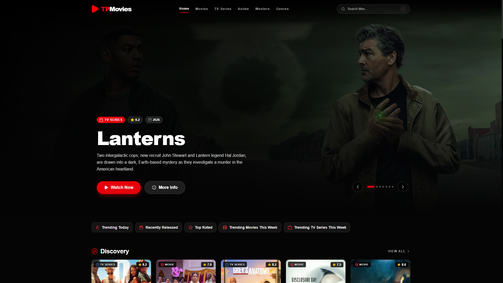

# TPMovies

TPMovies is a movie, TV series, anime, and Western catalog built with React and TypeScript. It uses API movie for media information and provides browsing, search, details, cast filmographies, season and episode navigation, continue watching, trailers, and external video-player sources.



## Tech Stack

- React 19 with React DOM
- TypeScript 6
- Vite 8 for development and production builds
- Tailwind CSS 4 for styling
- Motion for page and modal animations
- Lucide React for icons
- Local storage for continue-watching progress
- Oxlint for linting

## Features

- Browse movies, TV series, anime, Westerns, and genres
- View details, ratings, descriptions, trailers, recommendations, and cast
- Open cast profiles and filter filmographies
- Watch movies and navigate TV or anime seasons and episodes
- Switch between configured external streaming sources
- Save and resume continue-watching progress in the browser
- Responsive desktop and mobile layout
- Poster placeholders when images are unavailable or fail to load

## Getting Started

### Requirements

- Node.js 20 or newer
- npm

### Install and run

```bash
npm install
npm run dev
```

Vite will print the local development URL, usually `http://localhost:5173`.

The app includes a fallback demo key, but using your own key is recommended. Do not commit private keys or secret credentials.

### Gemini AI recommendations

Copy `.env.example` to `.env` and set `GEMINI_API_KEY` to a valid Gemini API key. The server loads this key with `dotenv`; do not use a `VITE_` prefix because that would expose it in the browser bundle.

## Available Scripts

| Command           | Description                              |
| ----------------- | ---------------------------------------- |
| `npm run dev`     | Start the Vite development server        |
| `npm run build`   | Type-check and create a production build |
| `npm run lint`    | Run Oxlint                               |
| `npm run preview` | Preview the production build locally     |

## Project Structure

```text
src/
  components/   Reusable UI such as cards, navigation, players, and modals
  hooks/        Shared React hooks
  pages/        Home, catalog, details, search, and watch views
  services/    Movie, anime, streaming, and progress services
  types/       Shared TypeScript models
  utils/       Formatting and helper functions
public/        Static assets such as screenshots and icons
```

## Streaming Sources

Streaming URL builders are configured in [`src/services/streamingSources.ts`](src/services/streamingSources.ts). Each source defines movie and TV URL functions. TV and anime playback receives the ID, season number, and episode number.

Only use streaming sources you are authorized to access and distribute. External providers may change their URLs or block iframe embedding.

## Production Build

```bash
npm run build
npm run preview
```

The generated production files are placed in `dist/`.
